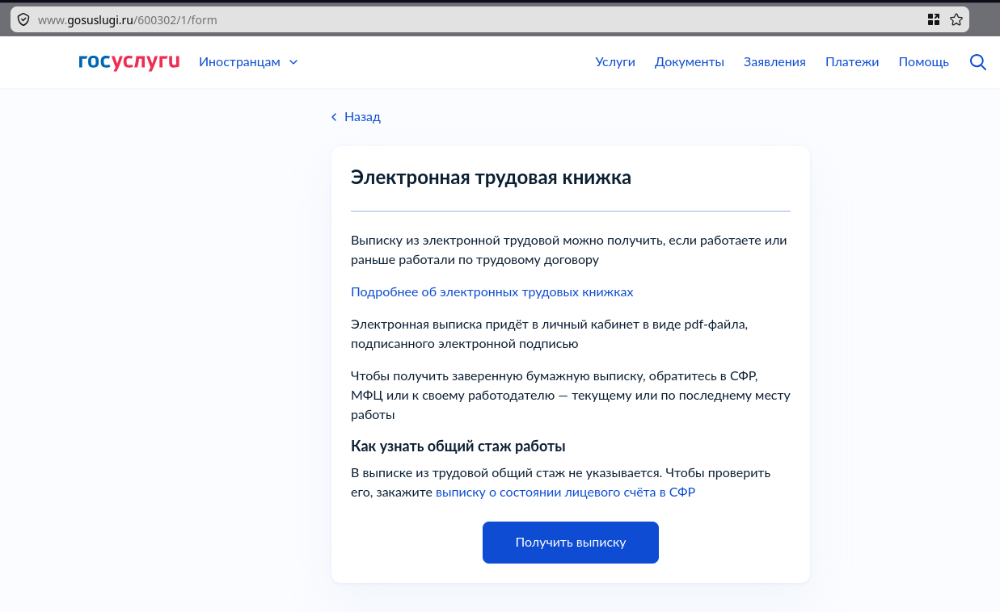
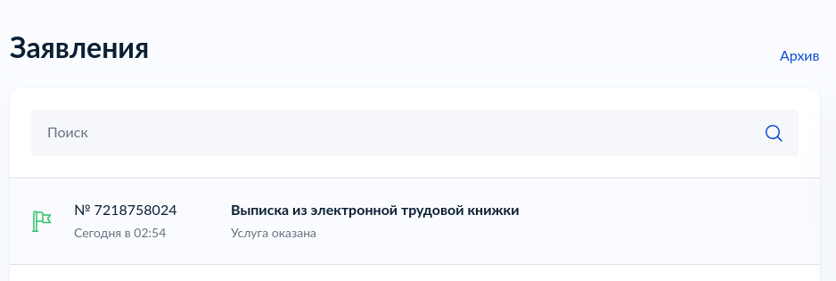
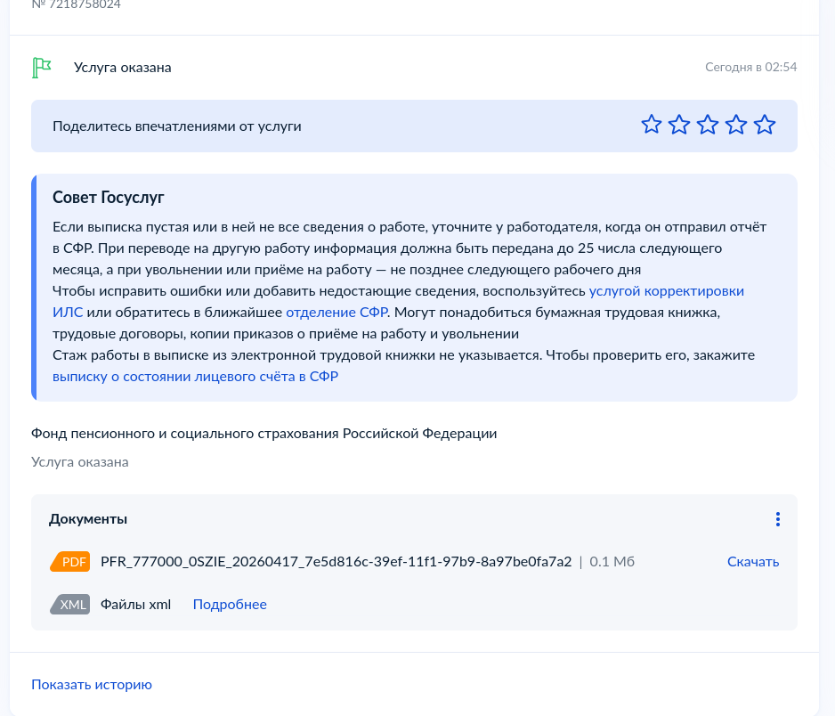
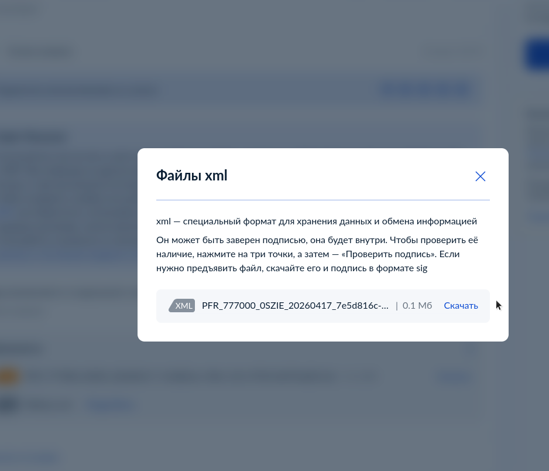

# RayonGosuslugiVerifcator


`RayonGosuslugiVerifcator` это CLI-инструмент для проверки XML-выписок из электронной трудовой книжки с Госуслуг.

Он нужен для простой и практичной задачи: взять XML-файл, который пришел с портала, и быстро понять:

- файл действительно не меняли после подписания
- подпись внутри XML криптографически валидна
- сертификат подписанта идет по доверенной государственной цепочке

То есть инструмент отвечает на нормальный человеческий вопрос: "это настоящий документ с Госуслуг или какая-то подделка".

КриптоПро для проверки не нужен.

## Что умеет

- проверяет `Reference` и `DigestValue` внутри XMLDSig
- проверяет `SignatureValue` по ГОСТ 2012
- проверяет сертификат подписанта по встроенной государственной цепочке
- отдает результат в понятном JSON или в текстовом виде

Внутрь бинарника уже встроены публичные сертификаты цепочки:

- `Федеральное казначейство`
- `Минцифры России` (`ГУЦ 2022`)

## Быстрый старт

Сборка:

```bash
go build -o stdpfrverify ./cmd/stdpfrverify
```

Проверка XML:

```bash
./stdpfrverify 1.xml
./stdpfrverify --pretty 1.xml
./stdpfrverify --text 1.xml
```

По умолчанию утилита печатает один JSON-объект в `stdout`.

## Пример результата

```json
{
  "valid": true,
  "file": "1.xml",
  "document_type": "СТД-ПФР",
  "integrity": {
    "ok": true,
    "message": "Файл не изменялся после подписания"
  },
  "signature": {
    "ok": true,
    "message": "Подпись криптографически подтверждена"
  },
  "trust": {
    "ok": true,
    "message": "Подпись сделана доверенной государственной цепочкой",
    "signer": "ФОНД ПЕНСИОННОГО И СОЦИАЛЬНОГО СТРАХОВАНИЯ РОССИЙСКОЙ ФЕДЕРАЦИИ",
    "issuer": "Федеральное казначейство",
    "root": "Федеральное казначейство"
  },
  "certificate": {
    "valid_from": "2025-09-02T09:09:05Z",
    "valid_to": "2026-11-26T09:09:05Z",
    "currently_valid": true
  }
}
```

## Как заказать выписку на Госуслугах

Ниже обычный бытовой сценарий, как получить нужный XML-файл.

### 1. Авторизуйтесь на Госуслугах

Зайдите в услугу "Электронная трудовая книжка":

[https://www.gosuslugi.ru/600302/1/form](https://www.gosuslugi.ru/600302/1/form)



На странице нажмите кнопку получения выписки.

### 2. Подождите, пока выписка сформируется

После отправки запроса можно спокойно идти пить чай минут на 10. Обычно документ приходит не мгновенно.

Потом откройте раздел заявлений и оказанных услуг:

[https://lk.gosuslugi.ru/orders](https://lk.gosuslugi.ru/orders)



### 3. Откройте оказанную услугу

Когда статус станет готовым, перейдите в нужную оказанную услугу.



Там будет блок с файлами. Нужен именно XML.

### 4. Скачайте XML-файл

Нажмите на файл XML, затем скачайте его.



После этого файл можно сразу прогонять через `RayonGosuslugiVerifcator`.

## Как проверить скачанный XML

Если файл называется, например, `report.xml`, команда будет такой:

```bash
./stdpfrverify report.xml
```

Если нужен более читабельный JSON:

```bash
./stdpfrverify --pretty report.xml
```

Если нужен обычный текстовый вывод:

```bash
./stdpfrverify --text report.xml
```

## Что именно проверяется

Инструмент последовательно делает три вещи:

1. Проверяет, что XML под подписью не был изменен.
2. Проверяет, что сама подпись внутри документа математически сходится.
3. Проверяет, что сертификат подписанта ведет к встроенной доверенной госцепочке.

Если любая из этих проверок не проходит, результат будет `valid: false`.

## Откуда берутся доверенные сертификаты

Публичные сертификаты цепочки взяты из каталога Федерального казначейства:

- [http://crl.roskazna.ru/crl/](http://crl.roskazna.ru/crl/)

В репозитории они лежат здесь:

- `internal/pkix/trust/fk_ucfk_2025.pem`
- `internal/pkix/trust/guc_2022_root.pem`

Если государственная цепочка обновится, эти файлы нужно будет обновить тоже.

## Флаги

| Флаг | Что делает |
|------|------------|
| `--pretty` | Печатает красивый JSON с отступами. |
| `--text` | Печатает текстовый отчет вместо JSON. |

## Ограничения

- инструмент рассчитан именно на XML с вложенной XMLDSig-подписью
- сейчас основной сценарий это выписки СТД-ПФР с Госуслуг
- если формат документа или государственная цепочка изменятся, проект нужно будет актуализировать

## Зависимости

- `goxmldsig` для canonicalization
- `gogost` для ГОСТ 34.10/34.11
- `signedxml` для enveloped transform

Внешние проприетарные зависимости проекту не нужны.
